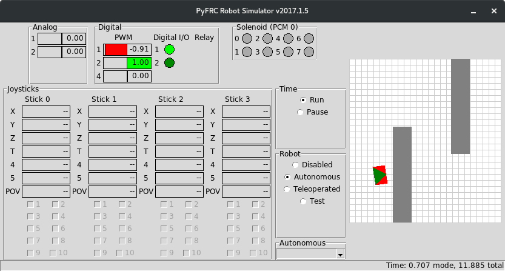

.. _simulator:

Robot Simulator
===============

   
   Screenshot of pyfrc simulator

An important (but often neglected) part of developing your robot code is to
test it! Because we feel strongly about testing and simulation, the RobotPy
project provides tools to make those types of things easier through the 
`pyfrc <https://github.com/robotpy/pyfrc>`_ project.

The pyfrc robot simulator allows very simplistic simulation of your code
in real time and displays the results in a (ugly) user interface. To run
the simulator, run your robot.py with the following arguments:

.. code-block:: sh

    Windows:   py -3 robot.py sim
    
    Linux/OSX: python3 robot.py sim

As there is interest, we will add more features to the simulator. Please feel
free to improve it and submit pull requests!

A new feature as of version 2014.7.0 is the addition of showing the robot's
simulated motion on a miniature field in the UI. This feature is really useful
for early testing of autonomous movements.

.. note:: For this to work, you must implement a physics module (it's a lot 
   easier than it sounds!). Helper functions are provided to calculate robot
   position for common drivetrain types (see below for details). There are
   physics examples provided in the `RobotPy Examples Repository <https://github.com/robotpy/examples>`_
   for each supported drivetrain type.

..  Adding custom tooltips to motors/sensors (doesn't work in 2015!)
	
	If you move the mouse over the motors/sensors in the simulator user interface,
	you will notice that tooltips are shown which show which type of object is
	using the slot. pyfrc will now read the 'label' attribute from each object,
	and if present it will display that as the tooltip instead. For example::
	
	    motor = wpilib.Jaguar(1)
	    motor.label = 'whatzit motor'
	
	This does not affect operation on the robot, as RobotPy will just ignore
	the extra attribute.

.. _smartdashboard:

Communicating with SmartDashboard
---------------------------------

The simulator can be used to communicate with the SmartDashboard or
other NetworkTables clients. For this to work, you need to tell SmartDashboard
to connect to the IP address that your simulator is listening on (typically
this is 127.0.0.1). Using the original SmartDashboard, you need to launch the
jar using the following command:

.. code-block:: sh

  $ java -jar SmartDashboard.jar ip 127.0.0.1

If you are using the SFX dashboard, there is a configuration option that you 
can tweak to get it to connect to a different IP. You can also launch it from
the command line using the following command:

.. code-block:: sh

  $ java -jar sfx.jar 127.0.0.1

Real Joystick support via pygame
--------------------------------

If you have pygame installed for Python 3, when you run the simulator any
supported joysticks you have plugged in should automatically provide joystick
input to the simulator. 

.. note:: The easiest way to install pygame is to install one of the precompiled
          wheels available on pypi via ``pip install pygame``. This should work
	  on OSX, Windows, and Linux.
          
	  Installing pygame from source requires having a compiler installed,
	  as it has many binary dependencies. It can be a tricky thing to accomplish,
          please refer to the pygame documentation for the right way to install
          it for your platform.

.. versionadded:: 2015.3.6

Gazebo simulation
-----------------

This is currently experimental, and hasn't been updated in awhile. If you
want to play with it now (and help us fix the bugs!), check out the
`robotpy-frcsim github repository <https://github.com/robotpy/robotpy-frcsim>`_.

Next Steps
----------

The next section discusses a very important part of writing robot code -- :ref:`unit_tests`.
